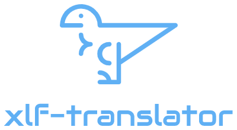

[](https://travis-ci.com/eltonmrk/xlf-translator)



# xlf-translator - it roars in different languages

XLF is an xml based format that is used in practice to translate software into different languages. [Read more on Wikipedia.](https://en.wikipedia.org/wiki/XLIFF)

To achieve a fast translation of your application, this library was created. It is based on the translation service of DeepL, which uses AI to achieve an excellent translation result.

## xlf-translator in action


## Installation

First, [Deno](https://deno.land) must be installed. Then execute the following command to install the application locally:
```
deno install --unstable -f --allow-read --allow-net --allow-write --allow-env https://deno.land/x/xlf_translator@0.1/index.ts
```
## Configuration

Create an `.env` file in the project folder. It should contain the following entries.

```
DEEPL_AUTH_KEY=Authentication Key from DeepL
CONFIG_SOURCE_FILE=Path to message file, e.g. ./languageFolder/messages.xlf
CONFIG_TARGET_PATH=Path to parent folder of generated file, e.g. ./languageFolder/generated
```
or run the command by passing variables 

```
deno run --allow-net --allow-read --unstable --allow-write --allow-env index.ts -- DEEPL_AUTH_KEY=X CONFIG_SOURCE_FILE=Y CONFIG_TARGET_PATH=Z
```

## Execution

In the project folder where the `.env` is located, execute the following command from `xlf-translator`. Sit back and enjoy your coffee, the work is done in a moment.